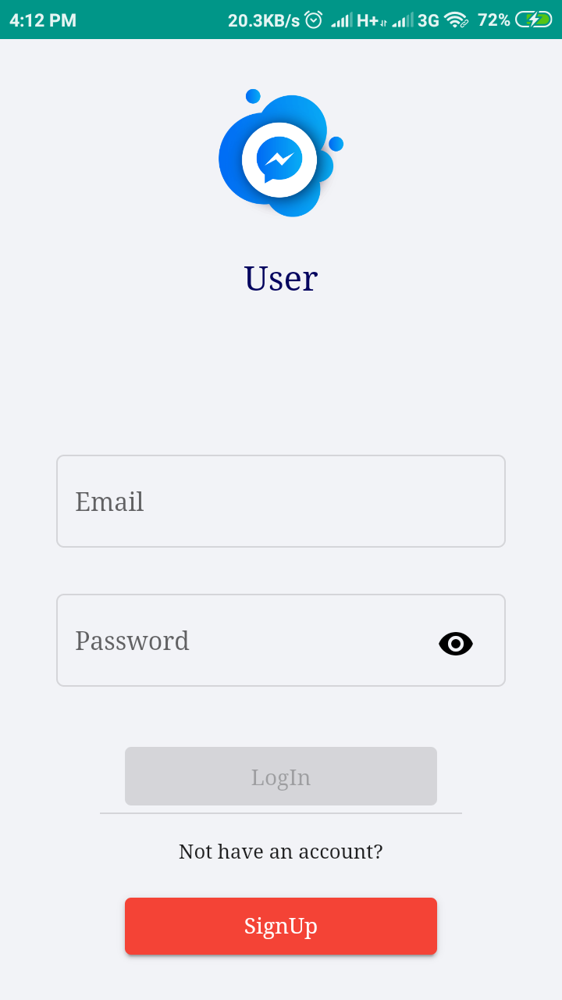
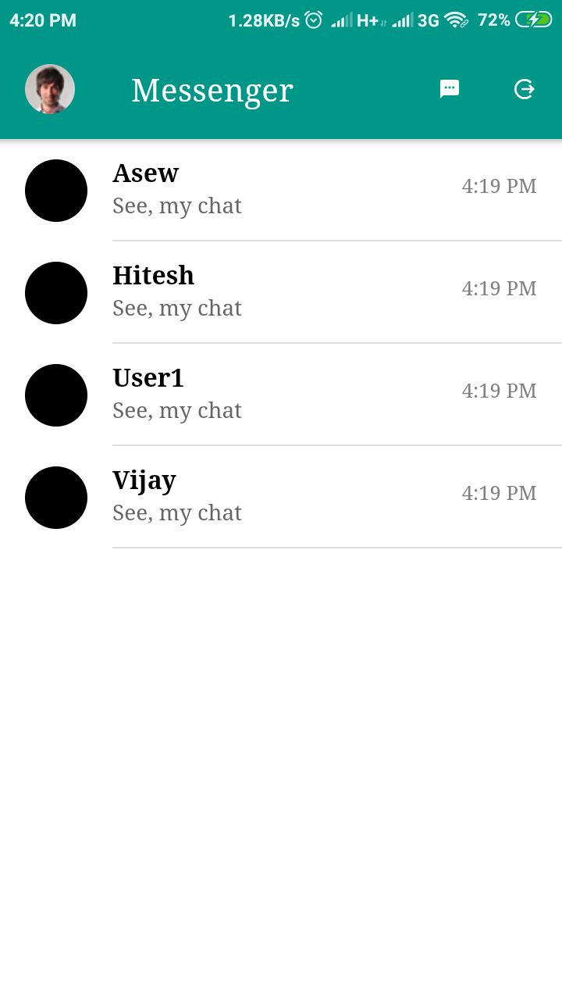
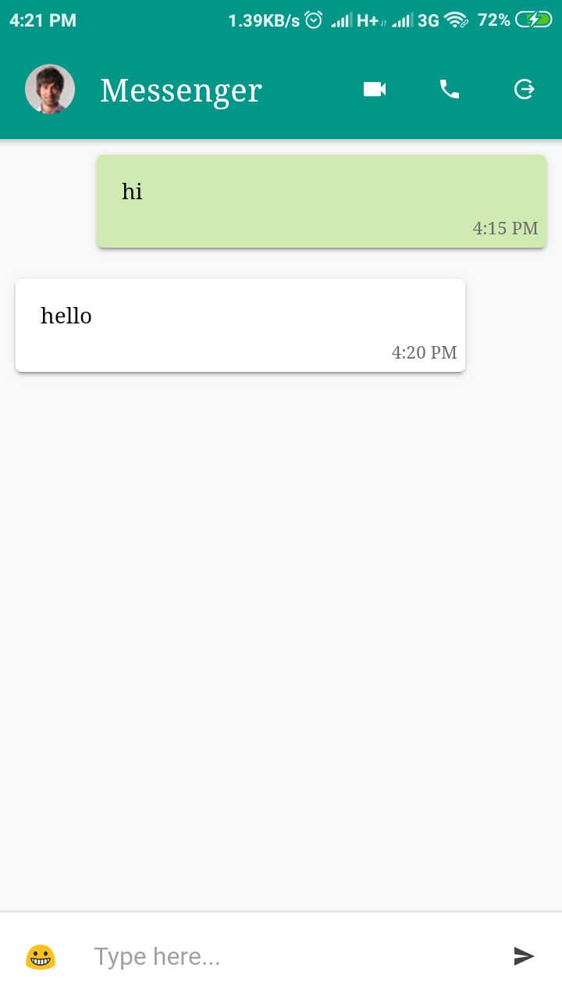

# ionic-messenger-firebase
This is ionic based messenger with firebase. There is two authorties one is admin and second is user. User can chat only with admin and admin can chat with all users of the app.

# Create account with firebase 
  1. google-service.json file and upload at root directory of the app
  2. Go to the root directory of the app run following command to install firebase package in your ionic app
      - npm install firebase
  
# Go to src/environment.ts and add 
    const config = {
      apiKey: "your_api_key",
      authDomain: "project_id.firebaseapp.com",
      databaseURL: "https://project_id.firebaseio.com",
      projectId: "project_id",
      storageBucket: "project_id.appspot.com",
      messagingSenderId: "sender_id"
    }; 

# Buid user and admin app with single code
We are using this single code for both user and admin.
# User
    - Go to config.xml 
    - change to app id to io.ionic.userMessenger
Then run build command
  ionic cordova build android
  
# Admin
    - app id will be io.ionic.adminMessenger
    - go to api.service.ts 
    - change admin: boolean = true;
    
Then run build command
  ionic cordova build android
  

# output will be

